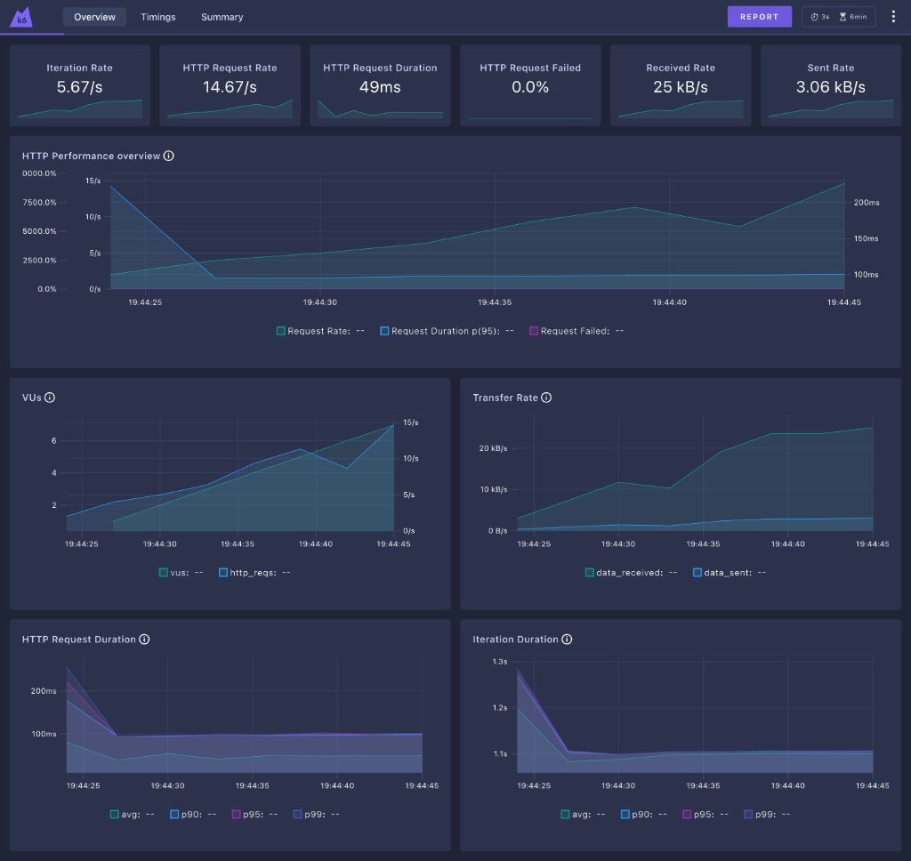
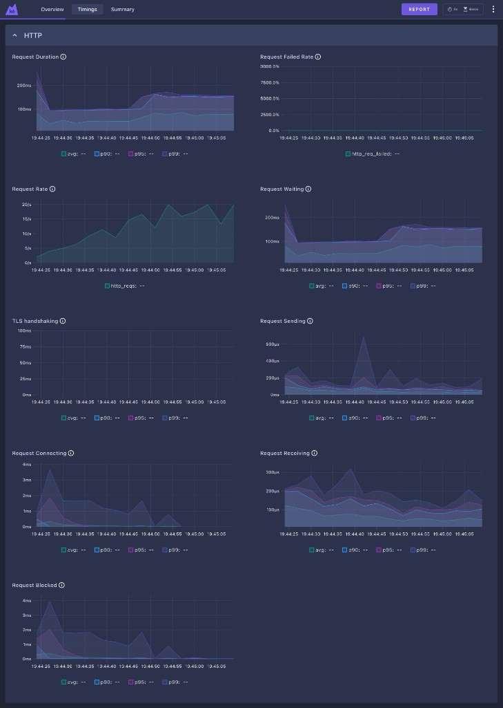
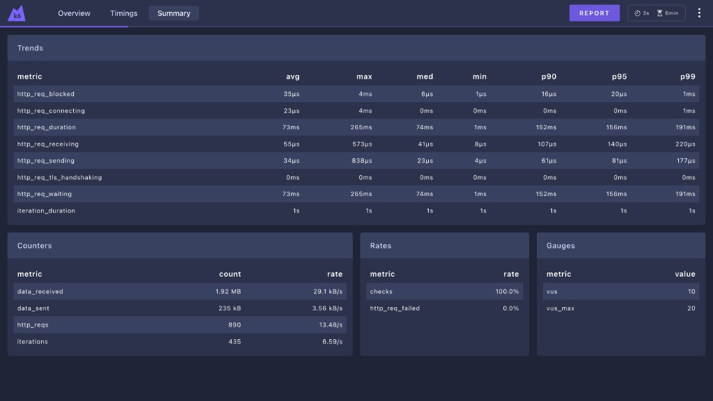

# Testes de Performance com K6 — Hub de Leitura

## Visão Geral

Este projeto implementa testes de performance utilizando o [K6](https://k6.io/) aplicados à API REST do **Hub de Leitura** (localhost:3000).

Os testes cobrem dois perfis de carga distintos sobre o endpoint `GET /api/users`, que exige autenticação via JWT.

---

## Estrutura do Projeto

```
K6/
├── config.js               # URL base da aplicação
├── GeraToken.js            # Helper para autenticação (POST /api/login)
├── README.md               # Este arquivo
├── tests/
│   ├── load-test.js        # Load Test
│   └── stress-test.js      # Stress Test
└── reports/                # Relatórios HTML gerados após execução
    ├── load-report.html
    └── stress-report.html
```

---

## API Testada

- **Aplicação:** Hub de Leitura (`http://localhost:3000`)
- **Endpoint:** `GET /api/users`
- **Autenticação:** Bearer JWT (gerado via `POST /api/login`)

---

## Tipos de Teste

### 1. Load Test (`load-test.js`)

**Objetivo:** Verificar o comportamento da API sob carga esperada em produção — uso normal e sustentado.

| Fase | Duração | VUs |
|------|---------|-----|
| Ramp-up | 30s | 0 → 10 |
| Carga estável | 2min | 10 |
| Pico moderado | 30s | 10 → 20 |
| Mantém pico | 2min | 20 |
| Ramp-down | 30s | 20 → 0 |

**Thresholds:**
- `p(95) < 1s` — 95% das requisições abaixo de 1 segundo
- `http_req_failed < 1%` — menos de 1% de falhas
- `checks > 99%` — taxa de sucesso acima de 99%

**Como executar:**
```bash
K6_WEB_DASHBOARD=true K6_WEB_DASHBOARD_OPEN=true K6_WEB_DASHBOARD_PERIOD=3s k6 run tests/load-test.js
```

---

### 2. Stress Test (`stress-test.js`)

**Objetivo:** Identificar o ponto de ruptura da API — empurrar além dos limites esperados e observar como a aplicação se comporta e se recupera.

| Fase | Duração | VUs |
|------|---------|-----|
| Ramp-up | 30s | 0 → 10 |
| Carga moderada | 1min | 50 |
| Stress crescente | 30s | 50 → 100 |
| Mantém stress | 1min | 100 |
| Pico máximo | 30s | 100 → 200 |
| Mantém pico | 1min | 200 |
| Ramp-down | 30s | 200 → 0 |

**Thresholds:**
- `p(95) < 2s` — 95% das requisições abaixo de 2 segundos
- `http_req_failed < 5%` — menos de 5% de falhas
- `checks > 95%` — taxa de sucesso acima de 95%

**Como executar:**
```bash
K6_WEB_DASHBOARD=true K6_WEB_DASHBOARD_OPEN=true K6_WEB_DASHBOARD_PERIOD=3s k6 run tests/stress-test.js
```

---

## Validações Implementadas

Ambos os testes validam:
- `status is 200` — resposta HTTP esperada
- `response tem conteúdo` — body não está vazio
- `tempo abaixo do threshold` — latência dentro do aceitável

---

## Relatórios

Os relatórios HTML são gerados automaticamente ao final de cada execução via `handleSummary`:

- `load-report.html` — relatório do Load Test
- `stress-report.html` — relatório do Stress Test

### Load Test — Dashboard Web

**Overview — VUs, Request Rate e Duração**


**Timings — Request Duration, Waiting, Connecting e Receiving**


**Summary — Métricas consolidadas**


---

## Pré-requisitos

- [K6](https://grafana.com/docs/k6/latest/set-up/install-k6/) instalado
- Hub de Leitura rodando em `http://localhost:3000`
- Node.js (para rodar a aplicação local)
